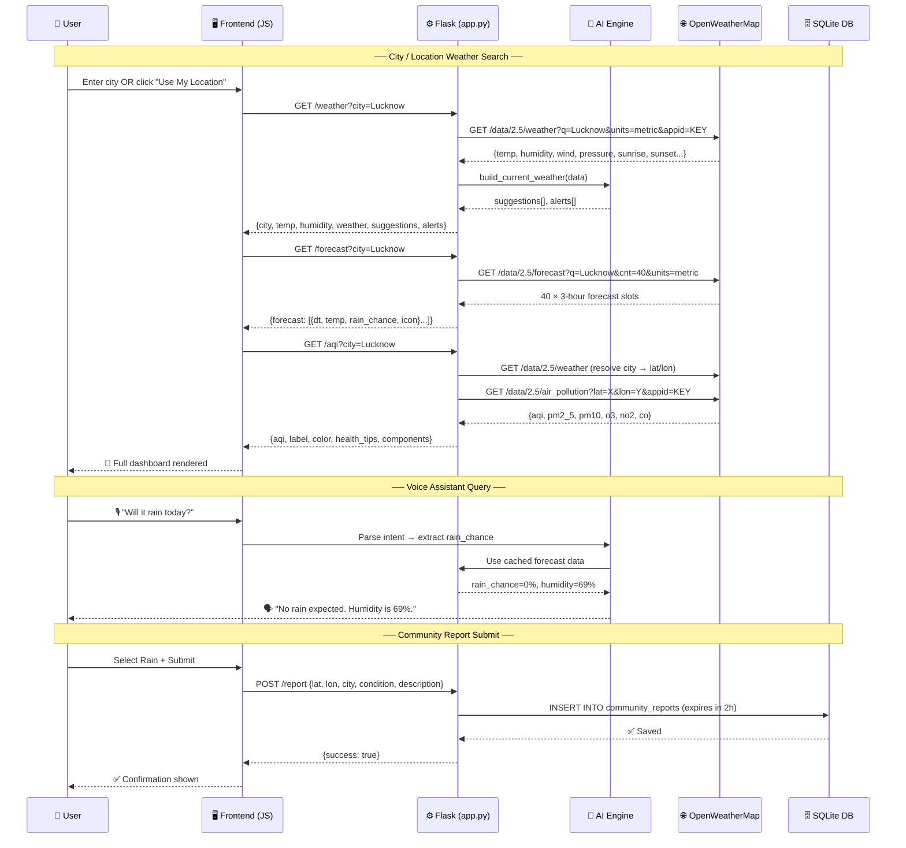
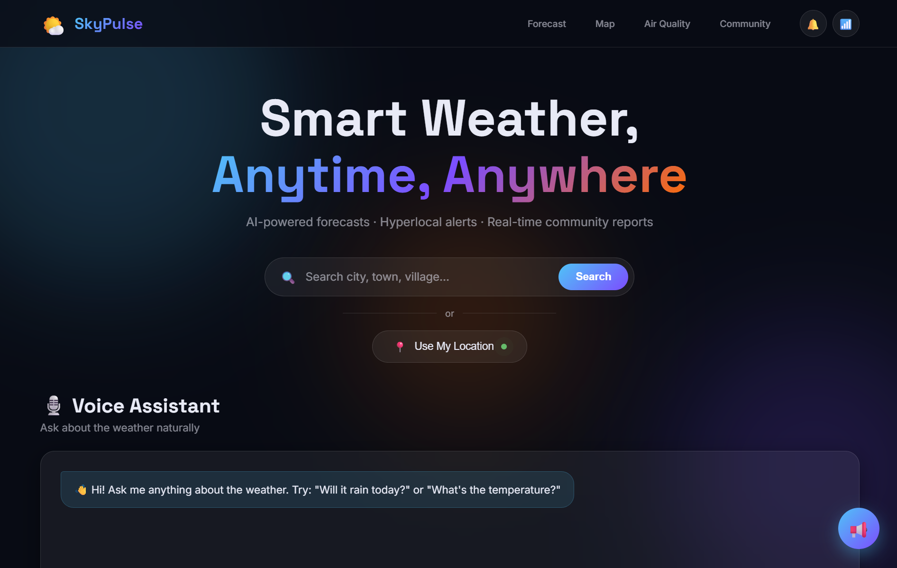
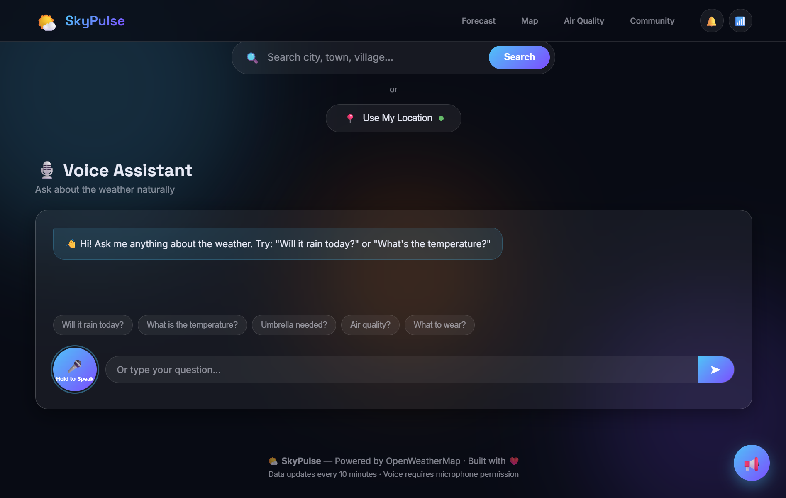
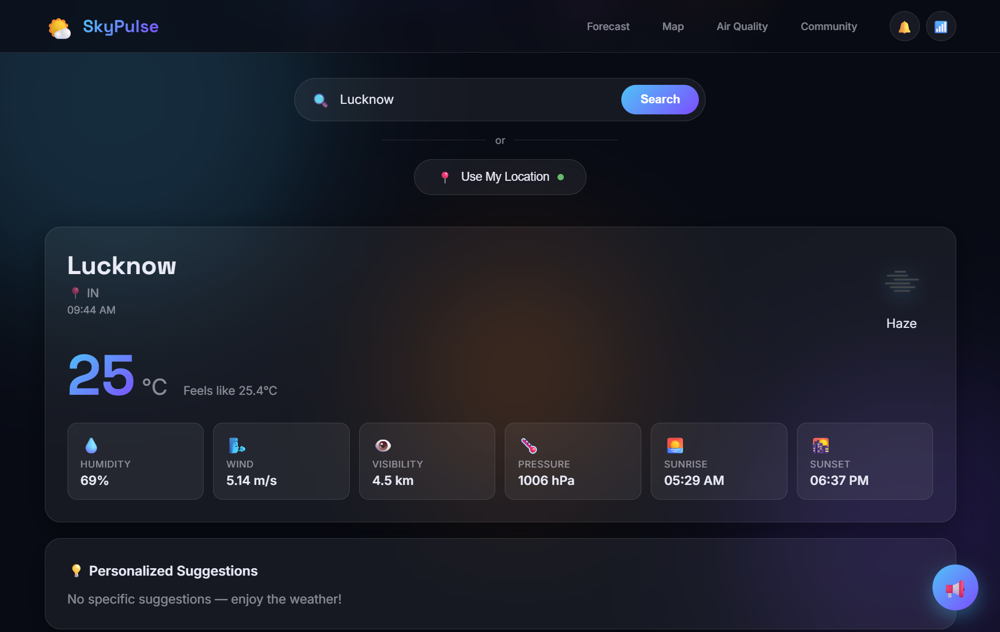
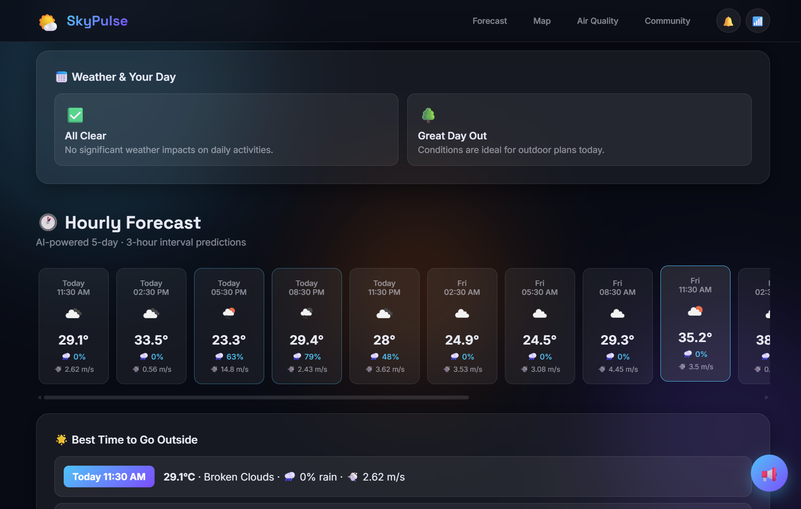
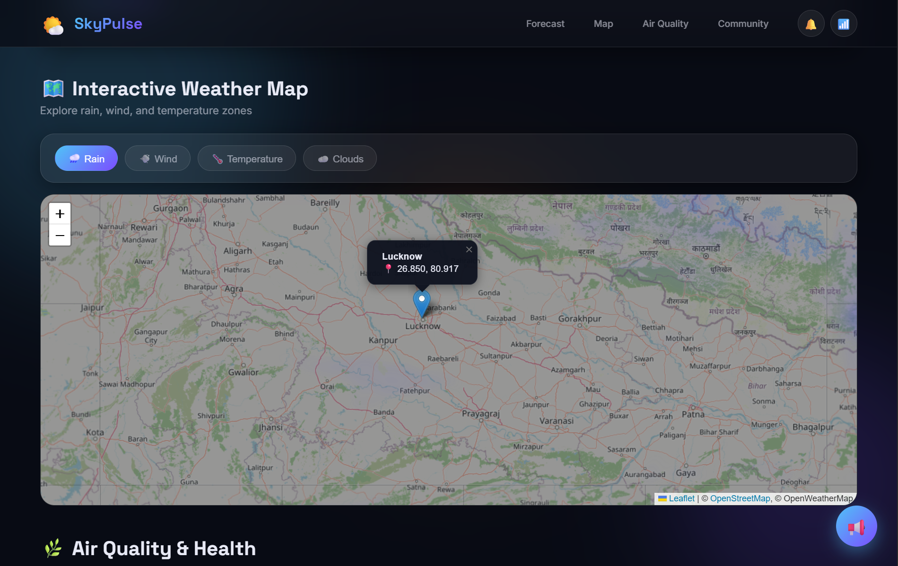
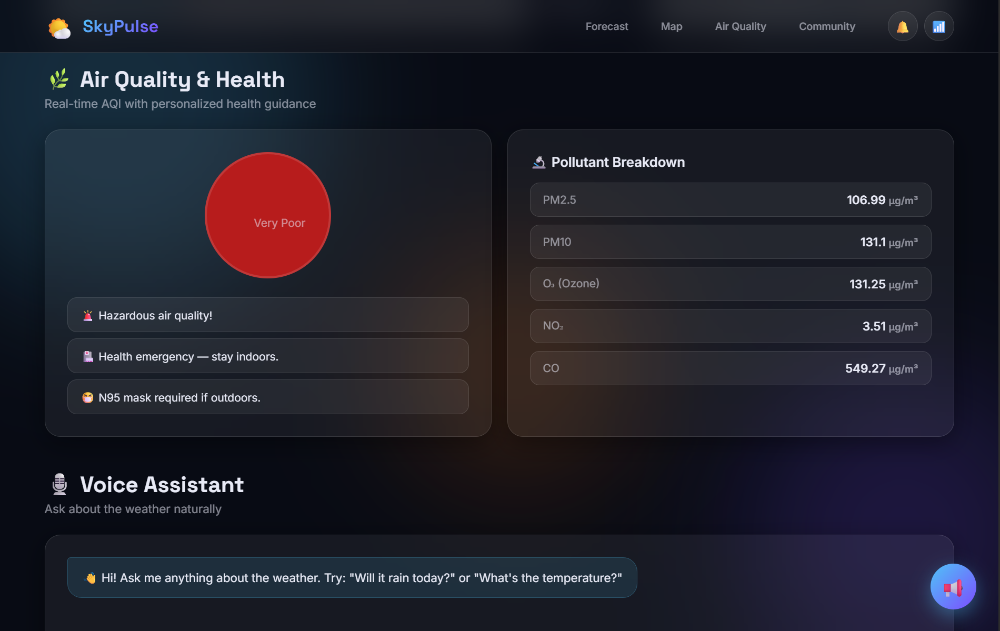
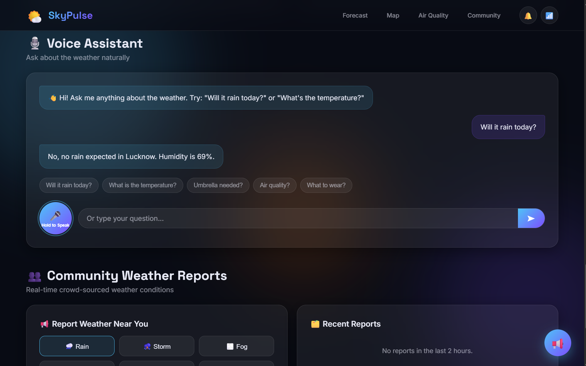
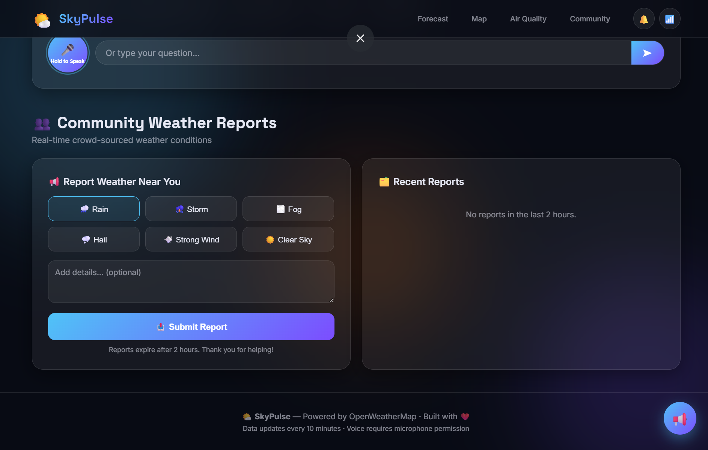

<div align="center">


<br/>

# 🌤️ SkyPulse

### *Smart Weather, Anytime, Anywhere*

**The next-generation weather intelligence platform — powered by AI, real-time APIs, voice interaction, and community crowd-sourcing.**

<br/>

[](https://python.org)
[](https://flask.palletsprojects.com)
[](https://openweathermap.org/api)
[](https://sqlite.org)
[](https://leafletjs.com)
[](LICENSE)

<br/>

[](https://github.com/abhinendra9792/Weather-Forecasting)
[](https://github.com/abhinendra9792/Weather-Forecasting/fork)
[](https://github.com/abhinendra9792/Weather-Forecasting/issues)
[](CONTRIBUTING.md)

<br/>

[🚀 Quick Start](#-quick-start) · [🎯 Features](#-features) · [🧠 AI Intelligence](#-ai-intelligence) · [📡 API & Data Flow](#-api--data-flow) · [📸 Screenshots](#-live-demo--screenshots) · [🤝 Contributing](#-contributing)

---

</div>

## 📖 Table of Contents

- [✨ About](#-about)
- [🎯 Features](#-features)
- [🧠 AI Intelligence](#-ai-intelligence)
- [📡 API & Data Flow](#-api--data-flow)
- [🗂️ Project Structure](#️-project-structure)
- [⚡ Quick Start](#-quick-start)
- [📸 Live Demo & Screenshots](#-live-demo--screenshots)
- [🛠️ Tech Stack](#️-tech-stack)
- [🌐 REST API Reference](#-rest-api-reference)
- [🗄️ Database Schema](#️-database-schema)
- [🤝 Contributing](#-contributing)
- [📝 License](#-license)

---

## ✨ About

**SkyPulse** is a full-stack weather platform built with **Flask (Python)** on the backend and a modern dark-themed UI on the frontend. It integrates **5 live OpenWeatherMap API endpoints**, a **SQLite-powered community reporting system**, a **conversational AI voice assistant**, and an **interactive Leaflet.js map** — making it one of the most feature-complete open-source weather apps available.

> Built for developers, weather enthusiasts, and anyone who wants to experience weather data intelligently.

---

## 🎯 Features

<table>
<tr>
<td width="50%">

**🌡️ Real-Time Current Weather**
- Temperature + Feels Like (°C)
- Humidity, Pressure, Visibility
- Wind speed & direction
- Sunrise & Sunset times
- Auto-generated weather alerts

</td>
<td width="50%">

**🕐 AI-Powered Hourly Forecast**
- 5-day · 3-hour interval predictions
- Rain probability per slot
- Best outdoor time recommendation
- "Weather & Your Day" AI summary

</td>
</tr>
<tr>
<td width="50%">

**🗺️ Interactive Weather Map**
- Leaflet.js + OpenStreetMap tiles
- Layer toggles: Rain · Wind · Temperature · Clouds
- Click-to-pin any location
- Coordinates display on selection

</td>
<td width="50%">

**🫁 Air Quality & Health Dashboard**
- Real-time AQI (1–5 scale)
- Pollutant breakdown: PM2.5, PM10, O₃, NO₂, CO
- Color-coded severity indicator
- Personalized health guidance

</td>
</tr>
<tr>
<td width="50%">

**🎙️ Voice Assistant (NLP)**
- Hold-to-speak microphone
- Pre-built quick question chips
- Context-aware conversational replies
- Browser speech synthesis (TTS)

</td>
<td width="50%">

**👥 Community Weather Reports**
- Submit hyperlocal conditions
- Categories: Rain, Storm, Fog, Hail, Wind, Clear
- Reports expire after 2 hours
- Real-time crowd-sourced feed

</td>
</tr>
<tr>
<td width="50%">

**📍 GPS Geolocation**
- One-click "Use My Location"
- Coordinate-based weather fetch
- Hyperlocal accuracy vs city search

</td>
<td width="50%">

**💡 Smart Suggestion Engine**
- Context-aware daily tips
- Clothing & activity recommendations
- Emergency health warnings
- Dynamic based on live conditions

</td>
</tr>
</table>

---

## 🧠 AI Intelligence

SkyPulse goes beyond raw data — it layers **AI-driven intelligence** across four core systems:

### 1. 🎙️ Natural Language Voice Assistant

Users interact via voice or text with natural weather questions. The assistant:
- Parses user **intent** from free-text input
- Maps intent to the relevant live API data point
- Generates a human-readable contextual response
- Speaks the answer back using **Web Speech API (TTS)**

**Example interaction (as seen in app):**
```
User:     "Will it rain today?"
SkyPulse: "No, no rain expected in Lucknow. Humidity is 69%."
```

**Pre-built query chips:**

| Query Chip | Data Source |
|---|---|
| *"Will it rain today?"* | `rain_chance` from `/forecast` |
| *"What is the temperature?"* | `temperature` from `/weather` |
| *"Umbrella needed?"* | `rain_chance + humidity` |
| *"Air quality?"* | `aqi` from `/aqi` |
| *"What to wear?"* | `temp + wind_speed` |

---

### 2. 💡 Real-Time Smart Suggestions Engine

The backend (`build_current_weather()` in `app.py`) dynamically generates personalized suggestions on every weather fetch:

```python
# app.py — suggestion logic (auto-generated per request)
if "rain" in description or humidity > 70:
    suggestions.append({"icon": "☔", "text": "Carry an umbrella — rain is likely."})
if temp > 30:
    suggestions.append({"icon": "👕", "text": "Wear light, breathable clothing."})
if temp < 10:
    suggestions.append({"icon": "🧥", "text": "Bundle up — it's cold outside!"})
if wind_speed > 10:
    suggestions.append({"icon": "🌬️", "text": "It's windy — avoid outdoor activities."})
if "clear" in description and temp < 30:
    suggestions.append({"icon": "🚶", "text": "Great weather for a walk or outdoor exercise!"})
if visibility < 1000:
    suggestions.append({"icon": "🚗", "text": "Low visibility — drive carefully."})
```

---

### 3. 🚨 Intelligent Alert System

Auto-triggered threshold-based alerts returned in every `/weather` response:

```python
# app.py — alert generation
if temp > 40:        → ☀️  "Heatwave alert! Temperature is {temp}°C. Stay hydrated."
if wind_speed > 20:  → 🌩️  "Storm warning! Wind speed is {speed} m/s. Secure loose objects."
if humidity > 90:    → 🌧️  "Very high humidity. Heavy rain likely. Carry an umbrella."
if temp < 0:         → ❄️  "Freezing temperatures ({temp}°C). Dress in heavy layers."
```

---

### 4. 🫁 AQI Health Guidance Engine

5-tier AQI response system with color-coded severity and health action:

| AQI | Label | Color | Action |
|---|---|---|---|
| 1 | 🟢 Good | `#4CAF50` | Open windows, exercise freely |
| 2 | 🟡 Fair | `#8BC34A` | Fine for most, monitor if sensitive |
| 3 | 🟠 Moderate | `#FFC107` | Limit prolonged outdoor exertion |
| 4 | 🔴 Poor | `#FF5722` | Avoid outdoor exercise, wear mask |
| 5 | 🔴 Very Poor | `#B71C1C` | **Health emergency — stay indoors, N95 required** |

---

## 📡 API & Data Flow

### System Architecture

```
┌──────────────────────────────────────────────────────────────────┐
│                          SKYPULSE                                │
│                                                                  │
│  ┌───────────────┐    ┌──────────────────┐    ┌──────────────┐  │
│  │   Browser     │───▶│  Flask Backend   │───▶│ OpenWeather  │  │
│  │ (HTML/CSS/JS) │    │    (app.py)      │    │   Map API    │  │
│  │               │◀───│                  │◀───│  (5 calls)   │  │
│  └──────┬────────┘    └────────┬─────────┘    └──────────────┘  │
│         │                     │                                 │
│  ┌──────▼────────┐    ┌────────▼─────────┐                      │
│  │  Leaflet.js   │    │   AI Engine      │                      │
│  │  Map + OWM    │    │ (Suggestions +   │                      │
│  │  Tile Layers  │    │  Alerts + AQI    │                      │
│  └───────────────┘    │  Health Tips)    │                      │
│                       └────────┬─────────┘                      │
│                                │                                │
│                       ┌────────▼─────────┐                      │
│                       │   SQLite DB      │                      │
│                       │ (Community       │                      │
│                       │  Reports TTL=2h) │                      │
│                       └──────────────────┘                      │
└──────────────────────────────────────────────────────────────────┘
```

### Full Request Lifecycle



---

## 🌐 REST API Reference

All endpoints served by Flask on `http://localhost:5000`

### `GET /weather` — Current Weather by City

| Param | Type | Required | Description |
|---|---|---|---|
| `city` | string | ✅ | City name (e.g. `Lucknow`) |

<details>
<summary>📄 View Response Schema</summary>

```json
{
  "city": "Lucknow",
  "country": "IN",
  "lat": 26.85,
  "lon": 80.917,
  "temperature": 25.0,
  "feels_like": 25.4,
  "humidity": 69,
  "pressure": 1006,
  "weather": "Haze",
  "weather_main": "Haze",
  "wind_speed": 5.14,
  "wind_deg": 120,
  "visibility": 4500,
  "sunrise": 1714969800,
  "sunset": 1715017020,
  "alerts": [],
  "suggestions": [
    { "icon": "☔", "text": "Carry an umbrella — rain is likely." }
  ]
}
```
</details>

---

### `GET /weather-by-coords` — Current Weather by GPS

| Param | Type | Required | Description |
|---|---|---|---|
| `lat` | float | ✅ | Latitude |
| `lon` | float | ✅ | Longitude |

---

### `GET /forecast` — 5-Day Hourly Forecast

| Param | Type | Required | Description |
|---|---|---|---|
| `city` | string | ⬜ | City name |
| `lat` | float | ⬜ | Latitude |
| `lon` | float | ⬜ | Longitude |

<details>
<summary>📄 View Response Schema</summary>

```json
{
  "forecast": [
    {
      "dt": 1715000000,
      "temp": 29.1,
      "feels_like": 28.5,
      "humidity": 55,
      "weather": "Broken Clouds",
      "weather_main": "Clouds",
      "icon": "04d",
      "rain_mm": 0.0,
      "rain_chance": 0,
      "wind_speed": 2.62
    }
  ]
}
```
</details>

---

### `GET /aqi` — Air Quality Index

| Param | Type | Required | Description |
|---|---|---|---|
| `city` | string | ⬜ | Auto-resolves to coords |
| `lat` | float | ⬜ | Latitude |
| `lon` | float | ⬜ | Longitude |

<details>
<summary>📄 View Response Schema</summary>

```json
{
  "aqi": 5,
  "label": "Very Poor",
  "color": "#B71C1C",
  "health_tips": [
    "🚨 Hazardous air quality!",
    "🏥 Health emergency — stay indoors.",
    "😷 N95 mask required if outdoors."
  ],
  "components": {
    "pm2_5": 106.99,
    "pm10": 131.10,
    "o3": 131.25,
    "no2": 3.51,
    "co": 549.27
  }
}
```
</details>

---

### `POST /report` — Submit Community Report

**Request body (JSON):**

```json
{
  "lat": 26.85,
  "lon": 80.917,
  "city": "Lucknow",
  "condition": "rain",
  "description": "Heavy showers near Hazratganj"
}
```

**Condition values:** `rain` · `storm` · `fog` · `hail` · `strong_wind` · `clear_sky`

---

### `GET /reports` — Fetch Community Reports (last 2 hours)

```json
{
  "reports": [
    {
      "id": 1,
      "city": "Lucknow",
      "condition": "rain",
      "description": "Heavy showers near Hazratganj",
      "lat": 26.85,
      "lon": 80.917,
      "timestamp": 1715000000
    }
  ]
}
```

---

## 🗄️ Database Schema

SkyPulse uses **SQLite** — zero-config, auto-created on first run. No external database needed.

```sql
CREATE TABLE IF NOT EXISTS community_reports (
    id          INTEGER PRIMARY KEY AUTOINCREMENT,
    lat         REAL,       -- Submitter latitude
    lon         REAL,       -- Submitter longitude
    city        TEXT,       -- City name
    condition   TEXT,       -- rain | storm | fog | hail | strong_wind | clear_sky
    description TEXT,       -- Optional user note
    timestamp   INTEGER     -- Unix epoch — reports TTL: 2 hours
);
```

> Reports auto-expire — every `GET /reports` query applies a `WHERE timestamp > now - 7200` filter. No cron job or cleanup needed.

---

## 🗂️ Project Structure

```
SkyPulse/
│
├── app.py                    # 🐍 Flask backend — all routes, AI engine, DB
├── weather.db                # 🗄️  SQLite (auto-created on first run)
├── README.md                 # 📖 You're reading it
│
├── static/
│   ├── style.css             # 🎨 Dark-theme UI styles
│   └── background.jpg        # 🖼️  Background asset
│
├── templates/
│   └── index.html            # 🌐 Single-page app (HTML + JS + Voice API)
│
└── demo/                     # 📸 App screenshots (8 images)
    ├── Demo-1.png  →  Hero landing page
    ├── Demo-2.png  →  Voice assistant expanded
    ├── Demo-3.png  →  Live weather dashboard
    ├── Demo-4.png  →  Hourly forecast + AI daily planning
    ├── Demo-5.png  →  Interactive weather map
    ├── Demo-6.png  →  Air quality & health panel
    ├── Demo-7.png  →  Voice Q&A + community reports
    └── Demo-8.png  →  Community report submission form
```

---

## ⚡ Quick Start

### Prerequisites

- Python **3.10+**
- `pip`
- Free **OpenWeatherMap API key** → [Get yours here](https://openweathermap.org/api)

### Installation

```bash
# 1. Clone the repository
git clone https://github.com/abhinendra9792/Weather-Forecasting.git
cd Weather-Forecasting

# 2. Create virtual environment (recommended)
python -m venv venv

# Activate on macOS/Linux
source venv/bin/activate

# Activate on Windows
venv\Scripts\activate

# 3. Install dependencies
pip install flask flask-cors requests

# 4. Set your API key in app.py
# Open app.py and update line 9:
API_KEY = "your_openweathermap_api_key_here"

# 5. Run the server
python app.py

# 6. Visit in browser
# http://localhost:5000
```

> 💡 **Tip:** The SQLite database `weather.db` is auto-created on first run — no setup needed.

---

## 📸 Live Demo & Screenshots

### 🏠 Demo 1 — Hero Landing Page


> The hero section presents a bold gradient headline **"Smart Weather, Anytime, Anywhere"** on a deep dark background with subtle purple/blue ambient glow. Users can search any city worldwide, tap **"Use My Location"** for instant GPS-based weather, or scroll to the Voice Assistant. The top navigation links to Forecast, Map, Air Quality, and Community sections.

---

### 🎙️ Demo 2 — Voice Assistant Interface


> The Voice Assistant panel expands to reveal five quick-question chips — *"Will it rain today?", "What is the temperature?", "Umbrella needed?", "Air quality?", "What to wear?"* — enabling one-tap weather queries. A **"Hold to Speak"** microphone button activates the browser's SpeechRecognition API for hands-free input. Users can also type in the free-form input box. Responses are both displayed and spoken aloud via the Web Speech API.

---

### 🌡️ Demo 3 — Live Weather Dashboard


> Searching **Lucknow, IN** renders the live weather card at 09:44 AM showing **25°C / Haze**. Six metric tiles show: Humidity (69%), Wind (5.14 m/s), Visibility (4.5 km), Pressure (1006 hPa), Sunrise (05:29 AM), Sunset (06:37 PM). Data is sourced from `GET /weather` → `build_current_weather()`. The **Personalized Suggestions** section below renders AI tips dynamically based on the live conditions.

---

### 📅 Demo 4 — AI Forecast & Daily Planning


> The Forecast section shows two AI-generated day summaries: **"All Clear"** (no weather impacts on activities) and **"Great Day Out"** (ideal for outdoor plans). The **Hourly Forecast** scrollable timeline displays 3-hour slots across 5 days — each showing temperature, rain probability %, and wind speed. The **"Best Time to Go Outside"** card pinpoints the optimal window — *Today 11:30 AM · 29.1°C · Broken Clouds · 0% rain · 2.62 m/s*.

---

### 🗺️ Demo 5 — Interactive Weather Map


> A full **Leaflet.js** interactive map with **OpenStreetMap** base layer and **OpenWeatherMap tile overlays**. Users toggle between **Rain**, **Wind**, **Temperature**, and **Clouds** layer views. Clicking any location pins it and shows coordinates — here **Lucknow (26.850, 80.917)** is pinned on a northern India view. The map supports full zoom, pan, and layer switching.

---

### 🫁 Demo 6 — Air Quality & Health Panel


> The AQI dashboard displays a large red indicator circle: **"Very Poor"** (AQI Level 5 — the most severe tier). The right panel shows the full **Pollutant Breakdown**: PM2.5 (106.99 µg/m³), PM10 (131.1 µg/m³), O₃ Ozone (131.25 µg/m³), NO₂ (3.51 µg/m³), CO (549.27 µg/m³). Three AI-generated health alerts appear: *"Hazardous air quality!"*, *"Health emergency — stay indoors."*, *"N95 mask required if outdoors."* — all auto-generated from the AQI Level 5 mapping in `app.py`.

---

### 🤖 Demo 7 — Voice Q&A in Action + Community Reports


> A live voice assistant exchange: user asked **"Will it rain today?"** and received **"No, no rain expected in Lucknow. Humidity is 69%."** — the backend queried the `/forecast` rain probability and composed a natural language response. Below, the **Community Weather Reports** section begins with condition buttons (Rain, Storm, Fog) and a **Recent Reports** feed — showing no reports submitted in the last 2 hours at this time.

---

### 👥 Demo 8 — Community Report Submission


> The full Community Reports panel. Users submit a hyperlocal weather condition by tapping: **Rain 🌧️**, **Storm 🌪️**, **Fog ⬜**, **Hail 🌨️**, **Strong Wind 💨**, or **Clear Sky 🌟** — with an optional text description box. Clicking **"Submit Report"** posts to `POST /report`, saving to SQLite with a 2-hour TTL. Reports expire automatically — no manual cleanup. The **Recent Reports** panel on the right live-refreshes with nearby crowd-sourced conditions.

---

## 🛠️ Tech Stack

| Layer | Technology | Purpose |
|---|---|---|
| **Backend** | Python 3.10 + Flask | REST API server, routing, AI logic |
| **CORS** | Flask-CORS | Cross-origin request handling |
| **HTTP Client** | `requests` | Calls to OpenWeatherMap REST APIs |
| **Database** | SQLite3 (stdlib) | Community reports persistence (no setup) |
| **Frontend** | HTML5 + CSS3 + Vanilla JS | Single-page application UI |
| **Maps** | Leaflet.js + OpenStreetMap | Interactive, zoomable weather map |
| **Map Overlays** | OpenWeatherMap Tile API | Rain / Wind / Temp / Cloud layers |
| **Voice Input** | Web Speech API — SpeechRecognition | Microphone → text |
| **Voice Output** | Web Speech API — SpeechSynthesis | Text → spoken TTS response |
| **Weather Data** | OpenWeatherMap REST API v2.5 | 5 endpoints (weather, forecast, AQI...) |
| **Styling** | Custom CSS — dark theme | UI design system |

---

## 🤝 Contributing

Contributions are warmly welcome! Here's how to get involved:

```bash
# 1. Fork on GitHub

# 2. Clone your fork
git clone https://github.com/YOUR_USERNAME/Weather-Forecasting.git

# 3. Create a feature branch
git checkout -b feature/your-feature-name

# 4. Make changes and commit
git add .
git commit -m "feat: describe your change"

# 5. Push
git push origin feature/your-feature-name

# 6. Open a Pull Request on GitHub
```

### 💡 Ideas for Contributions

- 🌍 Multi-language voice assistant support
- 📊 Historical weather charts (7-day / monthly)
- 📱 Progressive Web App (PWA) + offline support
- 🔔 Push notification alerts for severe weather
- 🌡️ Fahrenheit / Imperial unit toggle
- 🗺️ Animated radar overlay on the map
- 🌙 Auto dark/light mode based on time of day
- 📧 Email weather digest subscriptions

---

**Built with ❤️ by [abhinendra9792](https://github.com/abhinendra9792)**

<br/>

🌤️ **SkyPulse** — Powered by OpenWeatherMap · Data updates every 10 minutes · Voice requires microphone permission

<br/>

*If SkyPulse helped you, please consider dropping a ⭐ on GitHub!*

[](https://github.com/abhinendra9792/Weather-Forecasting)

</div>
